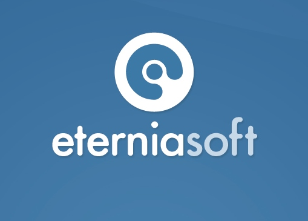

# Acerca de **Sperant**
---------------------------------------
  Sperant es un sistema desarrollado por **<a href="http://eterniasoft.com" target="new">EterniaSoft</a>** orientado a automatizar las operaciones de una inmobiliaria. Facilita el registro y seguimiento de clientes, desde que llegan hasta que independizan su propiedad.

  Así mismo permite una eficiente gestión de sus proyectos, unidades, vendedores, contratos y procesos de adquisición.
  Es una herramienta completa, con vistas muy sencillas de usar, y reportes que permitirán aprovechar al máximo toda la información ingresada en el sistema.

  
  
    

